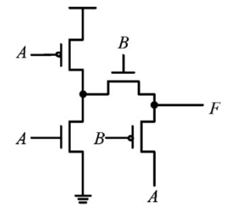

Embed math equations into Github Markdown file using a [web service](https://www.codecogs.com/latex/eqneditor.php)

# (5 pts)
Perform the following number-system conversions (show your work):

- a.   
- b.   
- c.   
- d.  

# (5 pts)
Evaluate the Boolean equation F = a AND (NOT b OR (c AND d)) for the given values
of variables a, b, c, and d:  

- a. a=1, b=1, c=0, d=1  
- b. a=0, b=0, c=0, d=1  

# (5 pts)
Draw the NAND(x,y) gate CMOS transistor circuit. Show the conduction path and output
value when: 

- a. x = 1 and y = 0
- b. x = 1 and y = 1

# (5 pts)
Convert the following equation directly to gate-level circuits: F = a + bcd’ + a'e + f’

# (5 pts)
Expand F(w,y,z) = wy to 
- a. sum-of-minterms form
- b. product-of-maxterms form

# (5 pts)
A car has a fuel-level detector that outputs the current fuel-level as a 3-bit binary number, with 000 meaning empty and 111 meaning full. Create a circuit that illuminates a “low fuel” indicator light (by setting an output L to 1) when the fuel level drops below level 3.

# (5 pts)
Convert the function F shown in the truth table in Table below to an *product-of-sum* equation. Don’t minimize the equation.

# (5 pts)
Implement the function above in *Dataflow Modeling* style Verilog and test its functionality via the testbench in [codes/exam/problem_7](../../codes/exam/problem_7). Include the waveform in the report.

# (5 pts) 
Use the theorems of boolean algebra to simplify the following logic function: F = m·n·o + q’·p’·n’ + p·r·m + q’·o·m·p’ + m·r (hint, the result has three terms. Don't spend too much time on this one. If stuck, move on first)

## **beyond this place there be dragons**

# (5 pts)
Implement a 4-to-2 priority encoder using only NOR gates.

- a. Derive the truth table.
- b. Derive the sum-of-product expression.
- c. Derive the product-of-sum expression.
- d. Convert the product-of-sum circuit into NOR gate implementation.

# (5 pts)
Analyze the CMOS circuit below. 

- a. Draw the conduction paths for
    - A = 0, B = 0
    - A = 1, B = 0
    - A = 0, B = 1
    - A = 1, B = 1
- b. Write the truth table.
- c. What gate is it?

